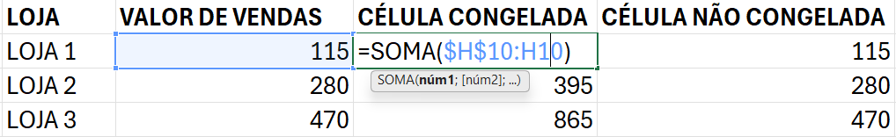

# Introdução ao Excel 365


Esse repositório foi desenvolvido a partir do conteúdo ensinado no [Bootcamp Bradesco GenAI & Dados](https://web.dio.me/track/bradesco-genai-dados), ministrado pela [DIO](https://www.dio.me/). O arquivo atua como um guia rápido e prático sobre os fundamentos do Microsoft Excel 365, cobrindo desde a estrutura básica de dados até o uso de fórmulas e atalhos essenciais.

## 🗂️ Estrutura do repositório
```
├── 📁 assets
│   └── 📁 img
│       ├── 🖼️ congelamento_de_celula.png
│       └── 🖼️ representacao_celulas.png
├── 📄 LICENSE
└── 📝 README.md
```

## 📁 Workbook e Worksheet
No ecossistema do Excel, a hierarquia de organização funciona da seguinte forma:

* **Workbook (Pasta de Trabalho)**: É o arquivo do Excel como um todo *(extensão .xlsx)*.
* **Worksheet (Planilha)**: São as abas individuais dentro de um arquivo. Um único *Workbook* pode conter múltiplas *Worksheets*.

## 🔲 Células (cells)

A **Célula** é a unidade básica onde os dados são inseridos, formada pelo cruzamento de uma *coluna (letra)* e uma *linha (número)*.

*Um Intervalo (Range)* é um conjunto de *duas ou mais células selecionadas*. A forma como as referenciamos muda completamente a seleção:

* **Intervalo inteiro (:)**: Seleciona tudo o que está entre os pontos.
    * **Exemplo:** ``D6:G6`` *(Seleciona da D6 até a G6)*.

* **Células específicas (;)**: Seleciona apenas os pontos isolados.
    * **Exemplo:** ``D6;G6`` *(Seleciona apenas a célula D6 e a célula G6)*.

* **Combinação de intervalos**: É possível unir grupos distintos.
    * **Exemplo:** ``D5:E5;D6:E6`` *(Seleciona dois blocos separados)*.

> ⚠️ *Nota Técnica: O caractere ``:`` representa continuidade ``("até")``, enquanto o ``;`` representa união ``("e")``.*

## 🖱️ Menus e Context Menus
* **Ribbon (Faixa de Opções):** O menu principal no topo da tela, dividido por abas *(Página Inicial, Inserir, Dados, etc.)*.

* **Context Menus (Menus de Contexto):** São os menus que aparecem ao clicar com o botão direito sobre um elemento. Eles são *dinâmicos* e oferecem *opções específicas* para o que foi selecionado *(célula, gráfico ou imagem)*.

## 🧪 Fórmulas essenciais
As fórmulas são instruções que executam cálculos ou tarefas. No Excel, toda fórmula começa com ``=``. Abaixo, as funções essenciais divididas por categoria:

### 🎲 Geração de Dados e Testes
* ``ALEATORIOENTRE(inferior; superior):`` Retorna um número inteiro pseudo-aleatório entre os valores especificados. Muito útil para criar massas de dados de teste.
    * **Exemplo:** ``=ALEATORIOENTRE(1; 100)`` gera um número entre 1 e 100.
    * **Uso Comum:** Criar massas de dados para testes de performance e lógica.
    * **Dica:** Combine com o atalho ``F9`` para gerar novos números instantaneamente.

### 📐 Operações Matemáticas e Estatísticas
* ``=SOMA(intervalo)``: A base de tudo. Soma todos os números em um intervalo selecionado.
* ``=MÉDIA(intervalo)``: Calcula a média aritmética dos valores.
* ``=CONT.VALORES(intervalo)``: Conta quantas células não estão vazias (útil para saber o tamanho de uma lista).

### Lógica e Busca
* ``=SE(condição; valor_se_verdadeiro; valor_se_falso)``: A fórmula mais importante para tomada de decisão.
    * **Exemplo**: ``=SE(B2>=7; "Aprovado"; "Reprovado")``
* ``=PROCV(valor_procurado; matriz_tabela; indice_coluna; [procurar_intervalo])``: Procura um valor na primeira coluna de uma tabela e retorna um dado na mesma linha.
* ``=PROCX(valor; pesquisa; retorno)``: *ou **XLOOKUP** em inglês*, é a versão moderna e mais poderosa do *PROCV (exclusiva do Office 365)*. Ela não quebra se você inserir colunas e busca para a esquerda!

> ⚠️ O **PROCV** só olha para a direita: *Se você tem o ID do funcionário, só consegue buscar o que está nas colunas à frente dele.*
<br>
O **PROCX** olha para qualquer lado: *Ele busca para a esquerda, para a direita e não "quebra" se você inserir uma nova coluna no meio da tabela.*

### 🔍 Exemplo prático - Comparativo: PROCV vs. PROCX
Imagine a seguinte tabela de Produtos:
| ID (Coluna A) | Produto (Coluna B) | Preço (Coluna C) |
|-----|-----|-----|
| 101 | Mouse Logi | R$150 |
| 102 | Teclado Mecânico | R$350 |

#### ✏️ Usando o PROCV (O método clássico)
Para achar o preço do **ID 101**, você precisa contar: ID é a **coluna 1**, Produto é a **coluna 2**, Preço é a **coluna 3**.

```Excel
=PROCV(101; A2:C10; 3; 0)
```

* **Problema:** Se você inserir uma nova coluna entre "Produto" e "Preço", a fórmula vai quebrar porque o preço deixará de ser a coluna 3.

#### ✒️ Usando o PROCX, ou XLOOKUP em inglês (O método moderno)
Aqui você não conta colunas. Você apenas aponta: "Procure nesta lista e me devolva o valor correspondente nesta outra lista".

```Excel
=PROCX(101; A2:A10; C2:C10)
```

* **Vantagem:** Se você inserir 10 colunas no meio, a fórmula continua funcionando, pois ela está "amarrada" à coluna C, não ao número 3.

> 🧩 **Dica:** *Diferente do **PROCV**, o **PROCX** não exige que a coluna de busca seja a primeira da tabela. Ele pode buscar para a esquerda ou para a direita sem problemas!*


#### Resumo
| Característica | PROCV (VLOOKUP) | PROCX (XLOOKUP) |
|-----|-----|-----|
| **Direção da busca** | Apenas para a direita | Qualquer direção (Esq/Dir) |
| **Inserção de colunas** | Quebra a fórmula | Ajusta-se automaticamente |
| **Complexidade** | Exige contar colunas | Usa seleção de intervalos |
| **Disponibilidade** | Todas as versões | Apenas Excel 365 / 2021+ |

## ❄️ Congelamento de células (Cells Freezing)
O símbolo ``$`` no Excel é utilizado para criar **Referências Absolutas**. Ele *"trava"* a coluna ou a linha para que, ao arrastar a fórmula, a referência não mude.

* ``A1``: **Referência relativa** *(muda em todas as direções)*.

* ``$A$1``: **Referência absoluta** *(fica totalmente travada)*.

* ``A$1`` ou ``$A1``: **Referências mistas** *(trava apenas linha ou apenas coluna)*.

> ⚠️ *Atalho: Pressione ``F4`` após digitar a referência da célula para alternar entre os modos de travamento.*

**Exemplo de aplicação**


## 🛣️ Atalhos de produtividade (Guia Rápido)

| Categoria | Atalho | Função |
| :----- | :----- | :----- |
| **Navegação** | `Ctrl + Setas` | Pula para a última célula preenchida na direção da seta. |
| **Navegação** | `Ctrl + Home` | Volta instantaneamente para a célula **A1**. |
| **Seleção** | `Shift + Setas` | Seleciona um intervalo de células manualmente. |
| **Seleção** | `Ctrl + Shift + Setas` | Seleciona todos os dados até a última célula preenchida. |
| **Seleção** | `Ctrl + T` | Seleciona toda a "região atual" (tabela) ao redor da célula ativa. |
| **Edição** | `F2` | Entra no modo de edição da célula (sem apagar o conteúdo atual). |
| **Edição** | `Ctrl + Enter` | Confirma a edição e mantém a seleção na mesma célula (ou preenche um intervalo). |
| **Fórmulas** | `Alt + =` | Atalho para a função **AutoSoma** (SOMA automática). |
| **Fórmulas** | `F4` | Alterna o congelamento da célula (insere o `$` para referências absolutas). |
| **Fórmulas** | `F9` | Recalcula a planilha (gera novos números em funções como `ALEATORIOENTRE`). |
| **Dados** | `Ctrl + Shift + L` | Ativa ou desativa os **Filtros** na tabela selecionada. |
| **Especial** | `Ctrl + Alt + V` | Abre o menu de **Colar Especial** (Valores, Fórmulas, Formatos). |
| **Formatação** | `Ctrl + Shift + $` | Aplica o formato de **Moeda** (R$) rapidamente. |
| **Formatação** | `Ctrl + Shift + %` | Aplica o formato de **Porcentagem**. |

## 🏆 Autor
Desenvolvido por [**Geovanni Marques**](https://github.com/GeovanniMarques)
<br>
*Estudante de Análise e Desenvolvimento de Sistemas*

Sinta-se à vontade para contribuir, comentar ou sugerir melhorias!

## 📄 Licença
Este projeto está licenciado sob a [Licença MIT](https://opensource.org/license/MIT) - Veja mais detalhes no arquivo [LICENSE](./LICENSE).
<br>
Sinta-se à vontade para usar, modificar e distribuir este código, desde que os créditos sejam mantidos.