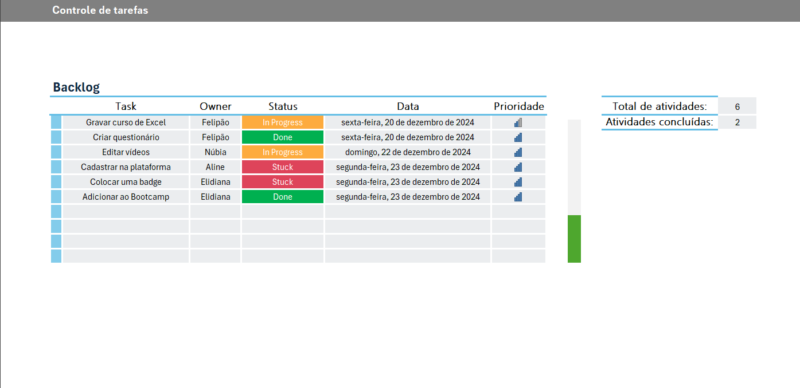

# 📝 Exercício prático: Controle de tarefas (Backlog)

<!--  -->

Este repositório contém um exercício prático de Controle de Backlog desenvolvido como parte do módulo de Excel do [Bootcamp Bradesco GenAI & Dados](https://web.dio.me/track/bradesco-genai-dados), ministrado pela [DIO](https://www.dio.me/). O objetivo do projeto foi aplicar, em um cenário real de gestão de tarefas, os conceitos de organização de dados, automação visual com indicadores de prioridade e fórmulas estatísticas para monitoramento de progresso.

    

## 🚀 O que foi implementado?

Para a construção deste controle de backlog, foram aplicadas as seguintes técnicas:

1. **Estruturação e estilo de tabela**

    Os dados foram convertidos em **Tabela Ofical do Excel**, o que permite a expansão automática de fórmulas e formatações conforme novas linhas são adicionadas. Foi utilizado um design limpo, com alternância de cores nas linhas para facilitar a leitura.

2. **Formatação Condicional Avançada**

    A parte visual foi automatizada para fornecer feedback imediato:

   * **Status:** Cores específicas para cada estado (``Done`` em verde, ``In Progress`` em laranja e ``Stuck`` em vermelho).

   * **Prioridade:** Utilização de **Conjunto de Ícones** (barras de sinal) para indicar o nível de urgência de cada tarefa de forma gráfica.

3. **Fórmulas de Resumo e Metas**
No painel lateral, foram aplicadas fórmulas para monitorar o volume de trabalho:

   * ``=CONT.VALORES()``: Utilizada para contar o total de atividades cadastradas no Backlog.

   * ``=CONT.SE()``: Utilizada para contar especificamente quantas tarefas possuem o status "Done", permitindo o cálculo de progresso.

4. **Visualização de Progresso ("Termômetro")**

    Criação de um gráfico dinâmico posicionado verticalmente que atua como um termômetro de conclusão, preenchendo-se conforme a porcentagem de atividades concluídas aumenta em relação ao total.

5. **Formatação de Dados**

    Aplicação de máscaras de data por extenso na coluna **Data**, garantindo que o cronograma seja lido com clareza *(ex: "sexta-feira, 20 de dezembro de 2024")*.

## 🛠️ Ferramentas Utilizadas

* Microsoft Excel 365
* Formatação Condicional (Regras de Texto e Ícones)
* Gerenciamento de Gráficos e Objetos Visuais
* Fórmulas Estatísticas Básicas

## 🏆 Autor
Desenvolvido por [**Geovanni Marques**](https://github.com/GeovanniMarques)
 
*Estudante de Análise e Desenvolvimento de Sistemas*

Sinta-se à vontade para contribuir, comentar ou sugerir melhorias!

## 📄 Licença
Este projeto está licenciado sob a [Licença MIT](https://opensource.org/license/MIT) - Veja mais detalhes no arquivo [LICENSE](../LICENSE).
 
Sinta-se à vontade para usar, modificar e distribuir este código, desde que os créditos sejam mantidos.